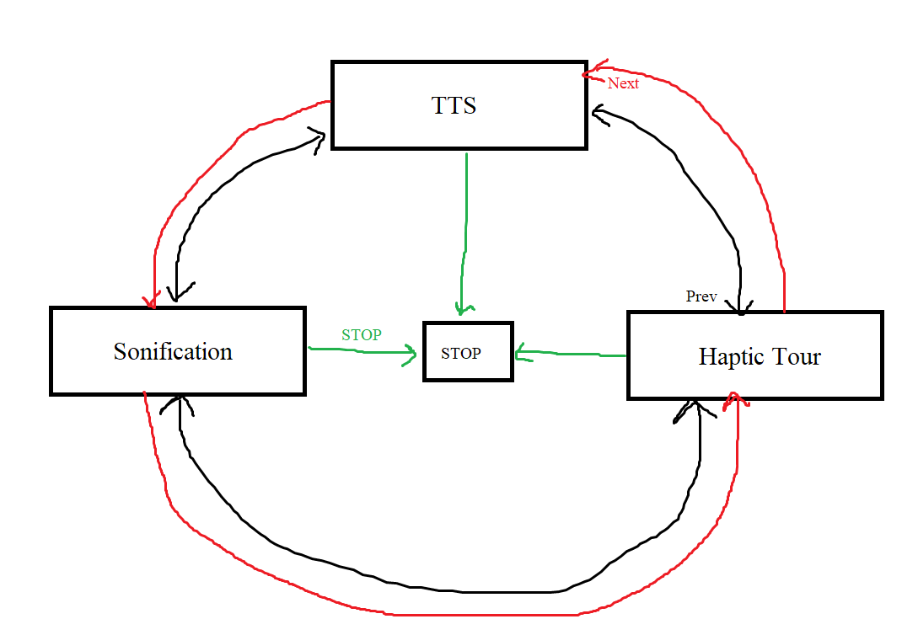
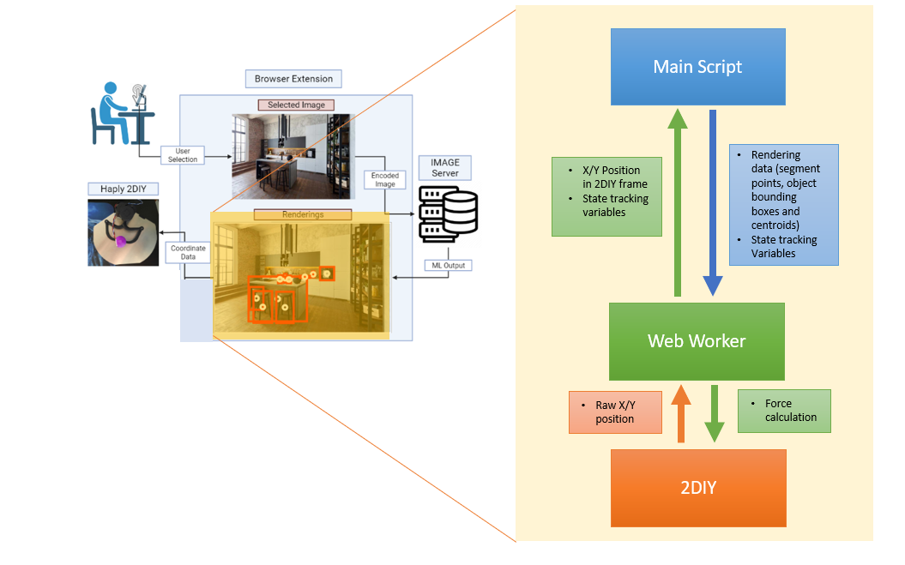

# What is this?

This repository contains the necessary components to run the multimodal audio-haptic photo renderer in the IMAGE extension using the Haply 2DIY device.

## Requirements

* A [Haply 2DIY](https://2diy.haply.co/) with its firmware installed.
## How To Use

* Ensure the Docker container hosting the appropriate haptic handler is running on the development / main server.
* Connect the Haply 2DIY device through a [serial USB connection](https://developer.mozilla.org/en-US/docs/Web/API/Web_Serial_API).
* In the extension settings under the "Advanced Options", turn on Developer Mode and select the "Haply 2diy" option. Change the server URL if needed.
* Get an IMAGE rendering of a photograph, wait for a response and then and check if the list of available renderers in the pop-up window contains a photo audio-haptic renderer. If not, recheck the first three steps, and/or try obtaining an IMAGE rendering for another photograph.
* Click the "Connect To Haply" button and select the COM port for the Haply device. Steadily grasp the 2DIY's knob and click the "START" button to initiate the audio-haptic experience.
* The audio-haptic experience is equivalent to that shown in state diagram below, i.e., it plays a TTS narration for each segment, followed by a sonified experience of all subsegments within that segment, and then a haptically guided tour of each subsegment with the 2DIY. Once all segments are covered, the same process is repeated for objects, starting with grouped objects and then ungrouped objects. Subsegments are defined as isolated contours of a segment, as shown in the image below.
* The Previous, Next, and Stop buttons can be used to navigate back and forth in the interaction, which always follows the pattern:
{:height="250px"}
NOTE:  this diagram will be changed slighly to indicate a starting state

{:height="250px"}

 For example, the clicking the "Next Button" during the TTS narration of a segment will immediately skip the TTS and move to the sonified experience of that segment. Clicking the "Next" button again will move to the guided tour of that segment, starting with the first subsegment. Clicking "Previous" during a TTS narration of the second segment will run a guided tour of the last subsegment of the first segment.

## How does it work?  



Data from the handler is sent to the ```hapi-utils.ts``` main script file.

Code to play audio files is contained within the main script, while all haptic code runs inside a web worker. Since the audio and haptic experiences are intended to be run one after the other in a timed-fashion, there is back and forth communication between the main script and worker to keep track of state variables. For example, the ```doneWithAudio``` variable is set to true once an audio file has finished playing, sent to the worker via a ```postMessage()```, and  then acknowledged by the worker to ready the next haptic segment or object to be played. The code that handles the interactivity with the Previous, Next, and Stop buttons is also contained in the ```worker.ts``` file.

## Haptic Loop

Code for the haptic calculations is contained in the ```worker.ts``` webworker file. A web worker allows scripts to be executed in background threads, allowing it to perform tasks without interfering with the main script. Since the force calculations required for the 2DIY can be intensive, the web worker ensures that the performance of the main script is not hindered.
 
The worker is instantiated in the ```hapi-utils.ts``` script by sending a preliminary message containing the  data points for the segments and objects contained in the image. The normalized coordinates returned from the handler are mapped into the 2DIY's frame of reference and then grouped into specific data types (segments, or objects) which are then utilized in functions called from the haptic loop to trace contours or move to certain positions when necessary.

The worker is currently set up to infinitely loop, refreshing at a rate of 1 ms. However, stability issues occur when ensuring that this is maintained at all times. 

Within a single haptic loop, the worker is responsible for reading the current position of the end effector, communicating this position information along with state tracking variables to the main script, and finally calculating the required forces which are transmitted to the 2DIY.

The ```moveToPos()``` function is responsible for setting the forces based on the next position, calculated using the difference between the current end-effector position and next in the index of the current subsegment or object. It utilizes a PID filter and 5-way moving average filter.

For grouped objects, a convex hull is used to generate an array 'connecting' the centroid of each object within the group. Interpolation is then used to generate a much larger array of points using the ```upsample()``` function, which allows for the 2DIY to smoothly trace a path connecting the object centroids as if they formed a segment.

## Visuals

The visuals are generated in the ```hapi-utils.ts``` file. An HTML canvas is created under the dropdown for the haptic rendering using the ```createCanvas()``` function. This canvas displays the photo along with a visual avatar of the end effector's instantaneous position and the outline of any segment or object being rendered. 

The [requestAnimationFrame(draw)](https://developer.mozilla.org/en-US/docs/Web/API/window/requestAnimationFrame) function is responsible for drawing graphics on the canvas, including the photograph itself. The ```updateAnimation()``` called by the ```draw()``` callback function takes in the current position of the 2DIY's end-effector and information about the current segment and object, obtained from the web worker's haptic loop. Because the callback function is called 60 times a second, it is advisable to only draw immediately necessary information, such as the 2DIY avatar and outline of the current subsegment or object being drawn only.

## hAPI TypeScript Library 

The [hAPI library](https://github.com/Shared-Reality-Lab/IMAGE-browser/tree/main/src/hAPI/libraries) used in the project is a TypeScript port of the [Java hAPI library](https://gitlab.com/Haply/hAPI) originally authored by Oliver Anthony, [Haply Robotics](https://haply.co/). ```Vector.ts``` is an additional helper file for vector calculations.
